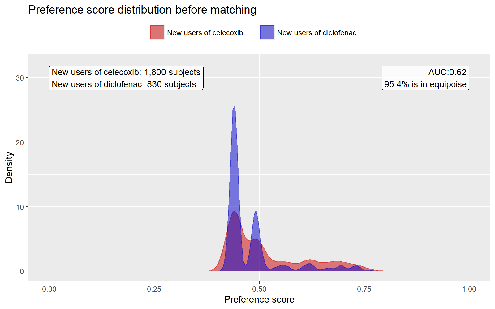
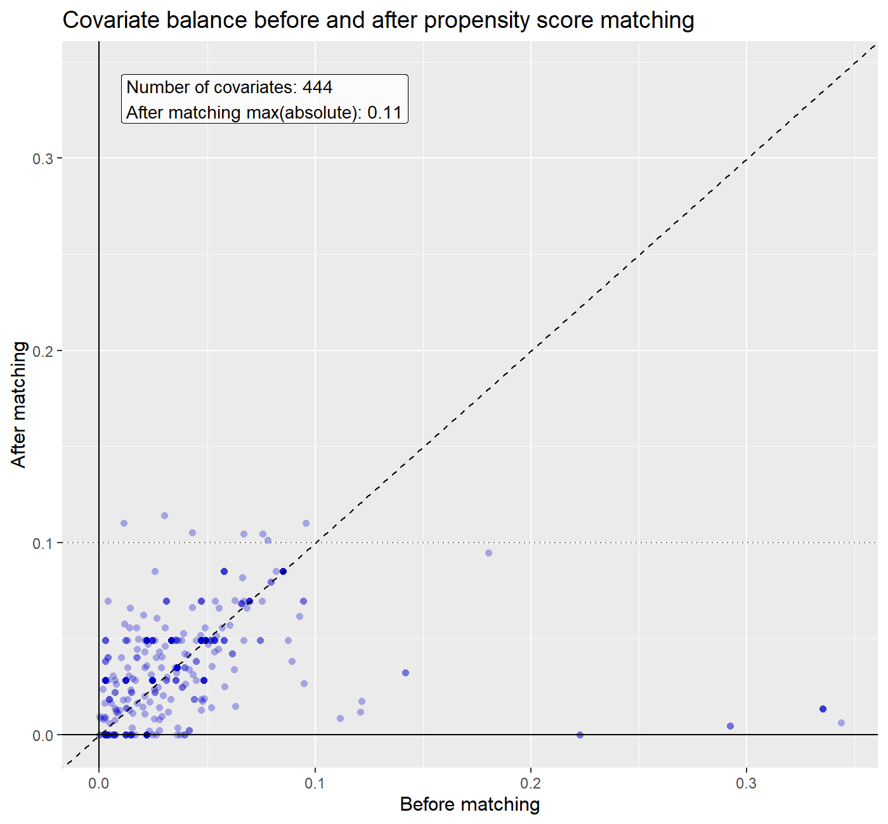
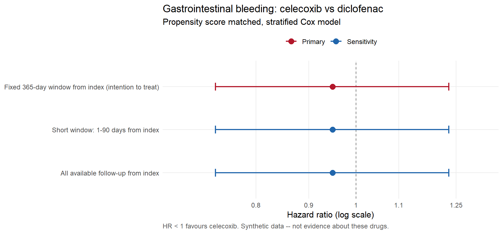
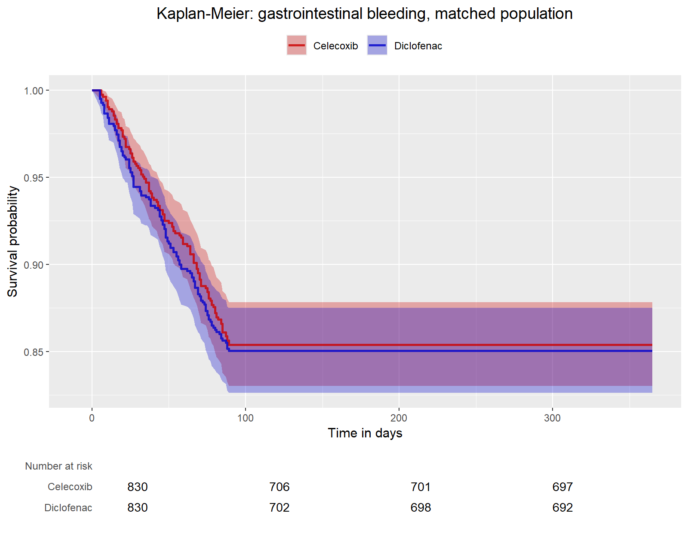

# Celecoxib vs diclofenac and gastrointestinal bleeding: a new-user cohort study in the OMOP CDM

This repository implements a new-user, active-comparator cohort study estimating the
risk of gastrointestinal bleeding among initiators of celecoxib compared with
initiators of diclofenac, using the OMOP Common Data Model and the OHDSI analytic
stack. The data are the Eunomia `GiBleed` synthetic CDM (version 5.3), containing
2,694 people. Cohorts are defined by concept sets in a YAML configuration file and
compiled to SQL; covariates are constructed with `FeatureExtraction`; treatment
assignment is modelled with an L1-regularised propensity score, adjusted by 1:1
matching, and the outcome is estimated with a stratified Cox proportional hazards
model. The estimate is not evidence about either drug — the data are simulated. What
the repository is intended to demonstrate is the design, the diagnostics, and the
handling of the points where the data did not support the design I started with.

---

## Design

The study is specified in two configuration files, `config/cohorts.yml` and
`config/analysis_settings.yml`. No concept identifier appears anywhere else in the
codebase. Each eligibility criterion compiles to a named SQL common table
expression, which is what produces the attrition table; the generated SQL is written
to `output/cohorts/` so it can be read rather than trusted.

**Cohorts.** Target: first-ever exposure to celecoxib (RxNorm ingredient 1118084).
Comparator: first-ever exposure to diclofenac (1124300). Outcome: first
gastrointestinal haemorrhage (SNOMED 192671). Entry is restricted to the first
qualifying exposure, so the design is new-user rather than prevalent-user. Prevalent
users are survivors of their own treatment, and including them selects for
tolerance.

**Comparator choice.** Diclofenac initiators rather than non-users. Non-users are
not a population; they are everyone who did not receive the prescription, including
people without the indication. An active comparator shares the indication and the
opportunity for the outcome to be recorded, which narrows the residual question to
why one NSAID was chosen over another.

**Eligibility.** 365 days of prior continuous observation within a single
observation period; at least one day of observation after index; age 18 or over at
index. Anyone with a gastrointestinal bleed strictly before index is excluded, which
makes the outcome incident. Anyone exposed to the comparator drug on or before index
is excluded, since such a person cannot be assigned to an arm on any principled
basis. The criteria are identical in both arms and are written out in full rather
than inherited, so that any asymmetry would be visible in a diff.

**Attrition** (`output/cohorts/attrition.csv`):

| Stage | Celecoxib | Diclofenac |
|---|---:|---:|
| Events matching the entry concept set | 1,844 | 850 |
| First occurrence per person | 1,844 | 850 |
| 365 days prior continuous observation | 1,800 | 830 |
| ≥1 day observation after index | 1,800 | 830 |
| Age ≥ 18 at index | 1,800 | 830 |
| No prior gastrointestinal bleed | 1,800 | 830 |
| No comparator exposure on or before index | 1,800 | 830 |

Only the prior-observation requirement removed anyone: 44 celecoxib initiators and
20 diclofenac initiators. The age criterion and both exclusions removed nobody. They
document intent rather than shape the population, and it would be misleading to
present the cohort as though they had done work. The outcome cohort contains 479
people.

**Time at risk.** Day 1 to day 365 after cohort start. Follow-up begins on day 1
rather than day 0 because a bleed recorded on the day of dispensing is more likely to
have preceded the prescription than to have been caused by it. Three sensitivity
windows are also run: 1–90 days, all available follow-up, and on-treatment. The
choice of a fixed window anchored on cohort start rather than an on-treatment window
was forced by the data, for reasons set out in the next section.

**Covariates.** Large-scale and data-driven: 548 covariates built from conditions,
drugs, procedures, measurements, observations, visit counts, demographics and the
Charlson index, over three baseline windows (−365, −180 and −30 days, all ending at
day 0). Every window ends at or before index, which is enforced by a check in
`R/config.R`; a covariate measured after time zero may be a consequence of treatment
or of the outcome, and adjusting for either introduces bias rather than removing it.
The exposure concepts themselves are excluded from the covariate set, since
otherwise the propensity model predicts treatment from treatment.

**Adjustment and outcome model.** L1-regularised logistic regression with
cross-validated penalty (`Cyclops`), 1:1 matching on the logit of the propensity
score with a caliper of 0.2 standard deviations, and a Cox model stratified by
matched set. The outcome model includes no covariates of its own; confounding
control happens at the matching stage, and keeping the two separable makes each
inspectable. Confidence intervals come from likelihood profiling rather than the
Wald approximation.

---

## What the data forced me to change

This section is the reason the repository exists. Three assumptions that would be
reasonable to carry into a study of this kind did not survive contact with the data.
Each was found by `analysis/01_explore_cdm.R`, which runs before any cohort is
built, and each is recorded in `output/explore/`.

### Exposure records have zero duration, so the on-treatment design is not estimable

On clinical grounds the primary analysis should be on-treatment. NSAID-induced
gastropathy is acute, dose-dependent and reversible, so risk should be counted while
the drug is being taken. That is not what this study does.

Every NSAID exposure record in this CDM has `drug_exposure_end_date` equal to
`drug_exposure_start_date`, and every person has exactly one record
(`output/explore/09_exposure_durations.csv`):

| Drug | Records | Persons | Min days | Mean days | Max days | Records per person |
|---|---:|---:|---:|---:|---:|---:|
| Celecoxib | 1,844 | 1,844 | 0 | 0 | 0 | 1 |
| Diclofenac | 850 | 850 | 0 | 0 | 0 | 1 |

The treatment episode is therefore one day long for everyone, cohort end equals
cohort start, and a time-at-risk window anchored on cohort end yields no person-time
and no events. Meanwhile every observed bleed falls between 5 and 89 days after
index (`output/explore/10_outcome_timing.csv`), so a window anchored on cohort start
captures them and one anchored on cohort end does not.

I changed the primary analysis to a fixed 1–365 day window and kept the on-treatment
window in the results table, reported as not estimable, rather than removing it. The
drug-era construction that collapses successive dispensings into a continuous
episode is still implemented in `R/cohorts.R`, because it is the correct
construction on a real CDM; here it returns a one-day episode for everyone. The
substitution is a limitation, and it biases toward the null: person-time after
discontinuation is unexposed but still counted.

### The concepts used have no descendants, so `include_descendants` does nothing

All three concept sets specify `include_descendants: true`. On a real vocabulary
that is what captures every branded product, strength and formulation containing an
ingredient. Here each concept set resolves to exactly one concept
(`output/explore/concept_set_resolution.csv`).

The vocabulary is not flat in general — `CONCEPT_ANCESTOR` contains 65,690 rows and
runs 16 levels deep — but for these three concepts it contains only the
self-referencing row. `CONCEPT` itself holds 444 rows, so most of the hierarchy
points at concepts absent from this database. "The vocabulary has a hierarchy" and
"my concept set will expand" are different claims, and only the second one matters.
The resolution step writes its expansion count to disk for exactly this reason: a
concept set that resolves without error is not the same as a concept set that
resolves to what you intended.

### Referential integrity is broken between OBSERVATION_PERIOD and PERSON

`OBSERVATION_PERIOD` contains 5,343 rows covering 5,343 distinct people, but
`PERSON` contains 2,694. 2,649 observation periods reference a `person_id` that does
not exist in `PERSON` (`output/explore/02_person_denominator.csv`). In a conformant
CDM this number is zero.

It does not affect the results here, because every analysis joins through `PERSON`
and the orphans are dropped. It matters because observation period is the
denominator for every rate in the study and the mechanism behind the new-user
definition, so a defect in it is not cosmetic. A smaller related issue: 0.13% of
condition records, 0.12% of drug records and 0.04% of procedure records fall outside
any observation period for their person, which is the database asserting that
something happened while it was not watching.

Separately, `DEATH` is empty, along with `VISIT_DETAIL`, `DEVICE_EXPOSURE`, `NOTE`,
`SPECIMEN` and `PAYER_PLAN_PERIOD`. The consequence for this study is that death
cannot be handled as a competing risk and cannot be distinguished from other reasons
for follow-up ending.

---

## Results

### Propensity score and overlap

`output/tables/ps_diagnostics.csv`:

| Metric | Value | Threshold | Passes |
|---|---:|---:|:--|
| Propensity score AUC | 0.622 | ≤ 0.80 | yes |
| Equipoise (preference score 0.3–0.7) | 0.954 | ≥ 0.20 | yes |

An AUC of 0.622 means treatment is only moderately predictable from recorded
baseline characteristics, which is the desirable case here — it indicates the two
groups overlap. This is the opposite of how AUC is read in a prediction model. The
preference score medians are 0.492 for celecoxib initiators and 0.441 for diclofenac
initiators, and 95.4% of subjects fall in the equipoise range.



### Covariate balance — this diagnostic failed

`output/tables/balance_summary.csv`:

| Metric | Value |
|---|---:|
| Covariates constructed | 548 |
| Covariates with a defined standardised mean difference after matching | 444 |
| Maximum absolute SMD before matching | 0.344 |
| Maximum absolute SMD after matching | 0.114 |
| Mean absolute SMD before matching | 0.0385 |
| Mean absolute SMD after matching | 0.0368 |
| Covariates above 0.10 before matching | 15 |
| Covariates above 0.10 after matching | 7 |

**The pre-specified balance threshold was not met.** The configured threshold is a
maximum absolute standardised mean difference of 0.10; the achieved value is 0.114.
Seven of 444 evaluable covariates remain above the threshold, or 1.58%. Matching
reduced the largest imbalance from 0.344 to 0.114, but it did not reach the
criterion, and the study is reported as failing that diagnostic rather than with an
adjusted threshold.

The 104 covariates without a defined SMD after matching are those with zero variance
in the matched set; they cannot be judged balanced or unbalanced and are excluded
from the percentages.

Whether this failure matters depends on which covariates remain imbalanced, not on
the count. `output/tables/balance_worst_covariates.csv` lists them; they are
dominated by index-year indicators and low-prevalence conditions rather than by
variables with a strong prior path to gastrointestinal bleeding. That is an argument
for proceeding with the estimate, not for calling the diagnostic passed.

The larger caveat is that a standardised mean difference measures balance on
covariates that were measured. Smoking, alcohol, over-the-counter NSAID use,
*Helicobacter pylori* status and frailty are absent from this CDM. Balance on the
548 covariates that exist says nothing about them.



### Effect estimate

Matching produced 830 pairs from 1,800 celecoxib and 830 diclofenac initiators.
`output/tables/results_main.csv`:

| Time at risk | Analysis | Events (cele/diclo) | Person-years (cele/diclo) | Rate per 1,000 PY (cele/diclo) | Hazard ratio (95% CI) | p |
|---|---|---|---|---|---|---:|
| Day 1–365 from index | Primary | 121 / 124 | 817.6 / 817.9 | 148.0 / 151.6 | 0.95 (0.73–1.23) | 0.69 |
| Day 1–90 from index | Sensitivity | 121 / 124 | 203.6 / 204.0 | 594.4 / 607.7 | 0.95 (0.73–1.23) | 0.69 |
| All available follow-up | Sensitivity | 121 / 124 | 17,644 / 17,954 | 6.86 / 6.91 | 0.95 (0.73–1.23) | 0.69 |
| On-treatment | Sensitivity | — | — | — | not estimable | — |

The primary estimate is a hazard ratio of 0.95 (95% CI 0.73 to 1.23).

**This is a null result in the sense that no difference was detectable, not in the
sense that no difference exists.** The minimum detectable relative risk at 80% power
and a two-sided alpha of 0.05, given 245 outcomes across 597,377 person-days, is
1.43 (`output/tables/power_mdrr.csv`). Any effect smaller than that was outside this
study's resolution from the outset. The confidence interval is consistent with a 27%
reduction and a 23% increase in hazard, and the correct statement is that the study
does not distinguish the two drugs, not that the drugs do not differ.



Two features of the table are worth stating explicitly.

The three estimable windows return an identical hazard ratio while the incidence
rates differ by a factor of about 87. This is not an error. The Cox partial
likelihood depends only on the composition of the risk sets at the times events
occur; all events here fall within 89 days of index, so extending follow-up from 90
days to 365 days to all available time adds person-time during which nothing
happens, changing no risk set at any event time. Incidence rates have person-time in
their denominator and behave completely differently. The practical consequence is
that a rate quoted without its time-at-risk window is uninterpretable. This would not
hold on data where events accrue throughout follow-up.

Before matching, 355 of 1,844 celecoxib initiators and 124 of 850 diclofenac
initiators had a post-index bleed (19.3% against 14.6%). After matching, the rates
were 148.0 and 151.6 per 1,000 person-years. Most of the crude difference was
attributable to differences between the groups at baseline rather than to the drugs,
which is what the adjustment is for.

Median follow-up was 365 days in both arms, with minima of 13 and 23 days
(`output/tables/followup_distribution.csv`). Under a fixed window this is expected;
it would be a more informative diagnostic in an on-treatment analysis, where
censoring at discontinuation is not censoring at random.



---

## Limitations

The data are synthetic. Eunomia is simulated, so any association it contains is an
artefact of the simulation. Nothing here is evidence about celecoxib or diclofenac.

There are no negative control outcomes, and this is the largest methodological gap.
A set of outcomes with a known true hazard ratio of 1, run through the identical
pipeline, would give an empirical null distribution and hence a direct measurement of
residual systematic error, from which a calibrated confidence interval could be
derived. Without it, the interval above reflects random error only and assumes the
absence of residual confounding rather than measuring it. The reason it is absent is
that this vocabulary subset contains too few concepts to supply a usable control set;
`EmpiricalCalibration` is installed and the configuration block is present but
disabled in `config/analysis_settings.yml`.

Competing risks are not handled. The `DEATH` table is empty, so death is treated as
ordinary censoring. Where mortality is substantial relative to the outcome this
overstates the cumulative incidence a clinician would observe, and a Fine–Gray
subdistribution model would answer the clinical question more directly.

The balance diagnostic failed, as described above.

Time at risk was chosen from the data rather than from the design, and the
substitution biases toward the null.

The outcome definition is a single concept with no available descendants and no
validation against chart review, so its positive predictive value is unknown. Any
non-differential misclassification would also bias toward the null.

The estimate applies to the matched population of 830 pairs, not to all 1,800
celecoxib initiators. Roughly half the target cohort had no matchable comparator,
and generalisation beyond the matched population is extrapolation.

---

## Repository layout

```
config/     cohorts.yml, analysis_settings.yml — the full study specification
R/          function library: config validation, database access, CDM exploration,
            concept set resolution, cohort compilation, estimation, diagnostics
analysis/   00_install_dependencies, 01_explore_cdm, 02_build_cohorts,
            03_run_cohort_method, 04_diagnostics, 05_results, run_all
output/     explore/ cohorts/ cohort_method/ figures/ tables/
```

Decision points that a reader should interrogate are marked `[DECISION]` and
`[CHOOSE]` in the configuration files, and are re-printed as `DECISION REQUIRED`
blocks at the end of the relevant scripts.

## How to run it

Requires R 4.4.2 or later. Dependencies are pinned with `renv` against a dated
Posit Package Manager snapshot rather than plain CRAN, so the recorded versions
remain installable after they leave CRAN's current index.

```r
renv::restore()                        # installs the pinned library
source("analysis/00_install_dependencies.R")   # first run only: provisions a local JDK
```

`DatabaseConnector` loads `rJava` when its namespace loads, even against a local
file-based CDM that never opens a JDBC connection, so a JDK must be discoverable.
`analysis/00_install_dependencies.R` installs one into a per-user cache via
`rJavaEnv`; `.Rprofile` resolves it dynamically rather than recording an absolute
path.

Then, from the project root:

```bash
Rscript analysis/run_all.R
```

This runs the five analysis scripts in order, each in its own R session, and takes
about one minute. Eunomia downloads its synthetic CDM on first use (roughly 7 MB
compressed) and caches it in `data/`. Nothing contacts a clinical data source.

The pipeline runs on either DuckDB or SQLite; set `database.dbms` in
`config/analysis_settings.yml`. Both have been run and give identical estimates. All
SQL is written in OHDSI SQL and translated by `SqlRender`, so no statement is
dialect-specific.

Versions used: R 4.4.2, CohortMethod 6.0.3, FeatureExtraction 3.14.0,
CohortGenerator 1.1.1, DatabaseConnector 7.2.0, Eunomia 2.1.0, Cyclops 3.7.1.
